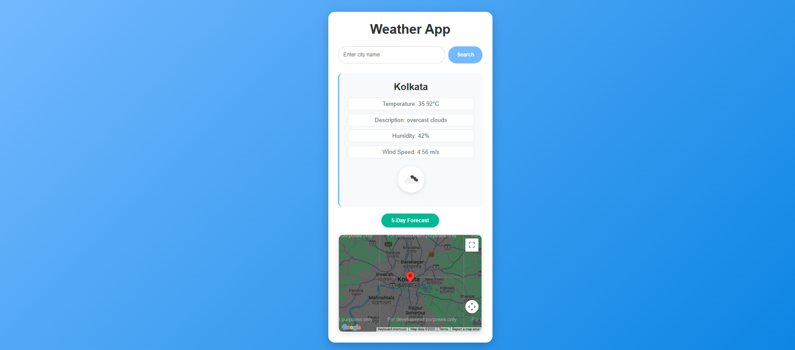
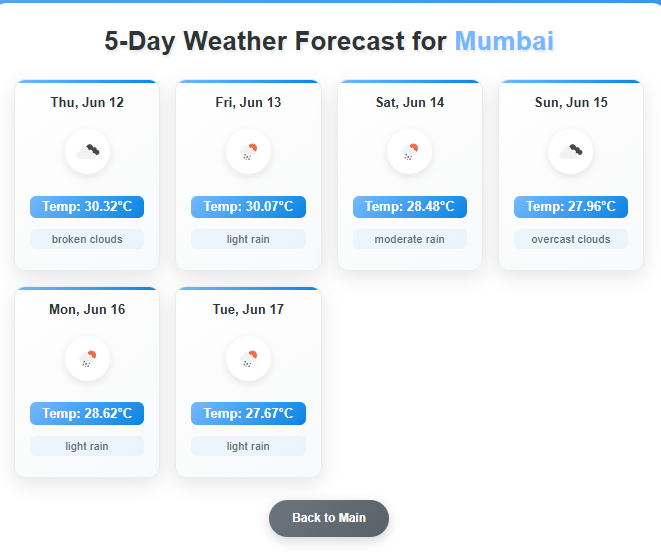

# Real-time Weather Application

This real-time weather application is built using HTML, CSS, and JavaScript. It allows users to search for a city, view current weather conditions, access a city map, and see a 5-day weather forecast.

## Features

- 🌆 **City Search**: Search for weather information by city name.
- 🌡️ **Current Weather Display**: View temperature, weather description, humidity, wind speed, and an icon representing the current weather conditions.
- 🗺️ **Interactive Map**: Displays the searched city on a Google Map.
- 📅 **5-Day Forecast**: Navigate to a separate page for a detailed 5-day weather forecast.
- 📱 **Responsive User Interface**: Designed to function well on various screen sizes.
- ⚡ **Debouncing and Throttling**: Optimizes search input and button clicks for better performance.

## Screenshots




## Technologies Used

- HTML5
- CSS3
- JavaScript (ES6+)
- 🌦️ OpenWeatherMap API (for weather data)
- 🗺️ Google Maps JavaScript API (for the map)

## Setup and Installation

1. **Clone the Repository (or Download the Files)**:
    ```bash
    git clone <repository_url>
    cd WeatherApp
    ```

2. **Obtain API Keys**:
    - 🗝️ **OpenWeatherMap API Key**: Sign up at [OpenWeatherMap](https://openweathermap.org/api) to get your API key.
    - 🗝️ **Google Maps JavaScript API Key**: Sign up at [Google Cloud Platform](https://cloud.google.com/maps-platform/) to obtain your API key. Ensure you enable the "Maps JavaScript API" for your project.

3. **Configure API Keys**:
    - Open `script.js` and replace `YOUR_OPENWEATHERMAP_API_KEY` and `YOUR_GOOGLE_MAPS_API_KEY` with your actual keys.
    - Open `forecast.js` and replace `YOUR_OPENWEATHERMAP_API_KEY` with your actual key.

    ```javascript
    // In script.js
    // ... existing code ...
    const OPENWEATHER_API_KEY = 'YOUR_OPENWEATHERMAP_API_KEY';
    const GOOGLE_MAPS_API_KEY = 'YOUR_GOOGLE_MAPS_API_KEY';
    // ... existing code ...
    ```

    ```javascript
    // In forecast.js
    // ... existing code ...
    const OPENWEATHER_API_KEY = 'YOUR_OPENWEATHERMAP_API_KEY';
    // ... existing code ...
    ```

4. **Open the Application**:
   Simply open the `index.html` file in your web browser. You can do this by double-clicking the file or using a local web server.

## Usage

1. 📝 Enter a city name in the search bar on the main page.
2. 🔍 Click the "Search" button or press Enter.
3. 🌍 View the current weather information and the city’s location on the map.
4. 📈 Click the "5-Day Forecast" button to see a detailed forecast for the searched city.
5. 🔙 Use the "Back to Main" button on the forecast page to return to the main weather display.

## Project Structure

```
WeatherApp/
├── index.html          # Main page for current weather and map
├── style.css           # General styling for index.html
├── script.js           # JavaScript for index.html (weather fetching, map, debounce/throttle)
├── forecast.html       # Page for 5-day weather forecast
├── forecast.css        # Styling for forecast.html
└── forecast.js         # JavaScript for forecast.html (forecast fetching, display)
├── image1.png          # Screenshot of the application
└── image2.png          # Another screenshot of the application
```

## Contributing

Feel free to fork the repository, make improvements, and submit pull requests.

## License

This project is open-source and available under the MIT License.
